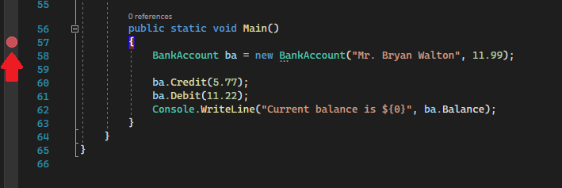
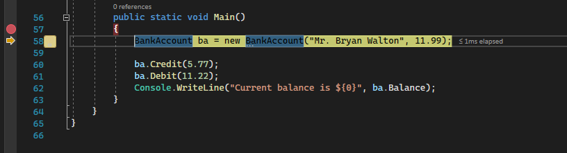
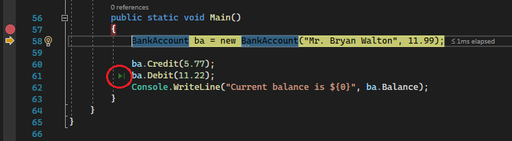
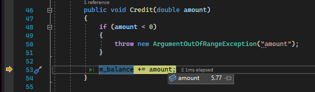
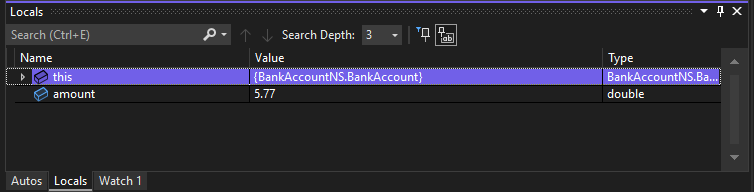
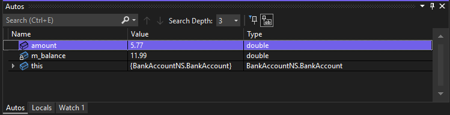
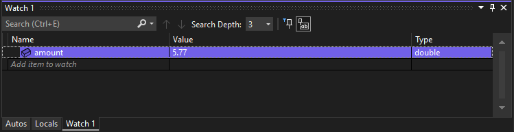
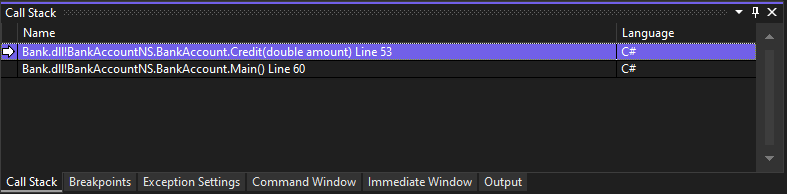
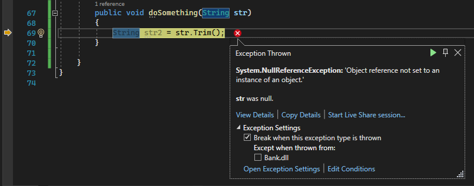
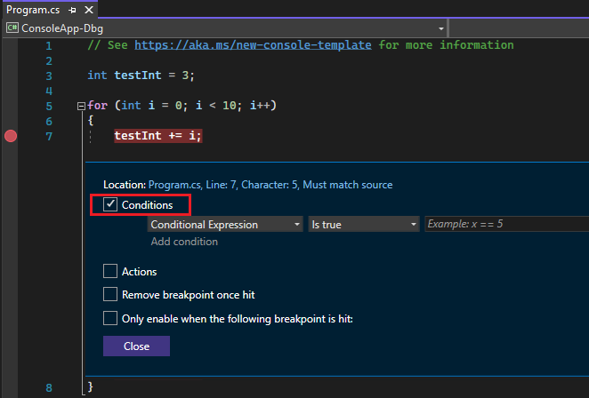

# Debuggaus (virheenetsintä) Visual Studiossa

Ohjelma voi kääntyä ja silti tehdä väärin. Ikä 8 saa aikuisen hinnan. Silmukka ei lopu. Summa on vain viimeinen lippu.

**Debuggaus** tarkoittaa: pysäytä ohjelma kesken ajon ja katso, mitä muuttujissa oikeasti on. Älä arvaa. Katso.

Kuvakaappaukset ovat Microsoftin [Debugger feature tour](https://learn.microsoft.com/en-us/visualstudio/debugger/debugger-feature-tour) -sivulta (Visual Studio 2022).

**Microsoft:** [Debugger feature tour](https://learn.microsoft.com/fi-fi/visualstudio/debugger/debugger-feature-tour?view=vs-2022)

## Kartta

| Asia | Yksi lause |
|------|------------|
| Breakpoint (F9) | Punainen pallo: suoritus pysähtyy tälle riville |
| F5 | Käynnistä debuggerilla |
| Ctrl+F5 | Aja ilman debuggeria — arjen ajotapa |
| Keltainen nuoli | Seuraava rivi, jota **ei ole vielä** ajettu |
| F10 | Aja tämä rivi ja siirry seuraavalle |
| Locals / hover | Näytä muuttujan nykyinen arvo |

## F5 vai Ctrl+F5?

| Näppäin | Mitä tekee | Milloin |
|---------|------------|---------|
| **Ctrl+F5** | Ajaa ilman debuggeria. Konsoli jää auki. | Kun haluat vain nähdä tulosteen |
| **F5** | Ajaa debuggerilla. Pysähtyy punaisiin palloihin. | Kun etsit vikaa |

Yläpalkin tilan pitää olla **Debug**, ei Release. Release on valmis versio asiakkaalle. Kurssilla pidä Debug.

## Breakpoint — punainen pallo

**Keskeytyspiste** (*breakpoint*) pysäyttää ohjelman ennen kyseisen rivin ajoa.

1. Klikkaa harmaata palkkia rivinumeron vasemmalla. Tai siirry riville ja paina **F9**.
2. Punainen pallo ilmestyy.
3. Paina **F5**.

Voit asettaa useita palloja. Poista pallo klikkaamalla sitä uudelleen tai F9 samalla rivillä.



*Punainen pallo rivinumeron vasemmalla merkitsee aktiivista breakpointia.*

Hyvä ensimmäinen paikka on rivi, jossa päätät hinnan tai luet iän. Kun ohjelma pysähtyy, näet `age`-muuttujan arvon ennen `if`-lausetta.

```csharp
int age = 8;                         // kokeile eri arvoja
decimal price = GetUnitPrice(age);   // ← F9 tähän, jos hinta on väärä
Console.WriteLine(price);
```

Kun keltainen nuoli on rivillä, **riviä ei ole vielä suoritettu**. F10 suorittaa sen ja siirtyy eteenpäin.



*Keltainen nuoli: suoritus on pysähtynyt tälle riville. F10 ajaa rivin.*

## Askella rivi kerrallaan

| Näppäin | Nimi | Mitä tekee |
|---------|------|------------|
| **F10** | Step Over | Aja tämä rivi. Jos rivillä on metodikutsu, metodi ajetaan kokonaan. Et mene sisään. |
| **F11** | Step Into | Mene metodin **sisään** ja näe sen rivit. |
| **Shift+F11** | Step Out | Poistu nykyisestä metodista takaisin kutsujaan. |
| **F5** | Continue | Jatka seuraavaan breakpointtiin tai ohjelman loppuun. |
| **Shift+F5** | Stop | Lopeta debug-tila. |

```csharp
static void Main(string[] args)
{
    int age = 8;
    decimal price = GetUnitPrice(age);   // F10: hinta ilmestyy, et näe metodia
                                         // F11: hyppäät GetUnitPrice-metodiin
    Console.WriteLine(price);
}
```

Kun hinta on väärä, F11 on hyödyllinen: näet, kumpaan `if`-haaraan suoritus menee.

**Run to Click:** vie hiiri riville debug-tilassa ja klikkaa vihreää nuolta. Suoritus etenee siihen riviin ilman uutta breakpointia.



*Vihreä nuoli rivin vasemmalla: **Run to Click**.*

## Katso muuttujan arvo

Kun ohjelma on pysähdyksissä:

1. Vie hiiri muuttujan päälle. Pieni ikkuna näyttää arvon.
2. Avaa **Locals** (Debug → Windows → Locals). Siinä ovat kaikki nykyisen metodin muuttujat: nimi, arvo, tyyppi.



*Vie hiiri muuttujan päälle: data tip näyttää nykyisen arvon.*



*Locals listaa paikalliset muuttujat. Alareunan välilehdiltä vaihdat Autos / Locals / Watch.*

**Autos** näyttää nykyisen ja edellisen rivin muuttujat. **Watch** on lista, johon lisäät itse nimet (oikea nappi → Add Watch). Alussa Locals ja hover riittävät.



*Autos näyttää nykyisen ja edellisen rivin muuttujat.*



*Watch 1: seuraat itse valitsemiasi muuttujia.*

Sijoita breakpoint silmukan **sisälle**, jos kertymä menee pieleen. Paina F10 kierros kierrokselta. Katso, nollataanko `subtotal` joka kierroksella.

## Call Stack — mistä tultiin

**Call Stack** näyttää metodiketjun: ylin rivi on missä olet nyt, alla metodit joista tultiin.



*Ylin rivi on nykyinen kohta (keltainen nuoli). Alla on kutsuja — tässä `Credit` kutsuttiin `Main`ista.*

Avaa: Debug → Windows → Call Stack. Hyödyllinen, kun sama metodi kutsutaan monesta paikasta.

## Poikkeus debuggerissa

Kun ohjelma kaatuu F5:n aikana, Visual Studio avaa **Exception Helper** -ikkunan suoraan virheen riville.



*Keltainen nuoli osoittaa rivin. Ikkuna kertoo tyypin (`NullReferenceException`) ja usein syyn. Lue ensin tyyppi ja viesti.*

Sama tieto on konsolissa, jos ajat Ctrl+F5:llä. Lue [virheilmoituksen lukeminen](Exception-Handling.md#virheilmoituksen-lukeminen).

## Ehdollinen breakpoint — myöhemmin

Jos silmukassa on 100 kierrosta eikä vika ole ensimmäisellä, klikkaa punaista palloa oikealla → **Conditions** → esim. `i == 50`. Silmukka pysähtyy vasta sitten.



*Rastita **Conditions** ja kirjoita lauseke.*

**Immediate Window** (Debug → Windows → Immediate) suorittaa yhden lausekkeen pysähdyksissä, esimerkiksi `age + 1`. Sitä ei tarvita ensimmäisellä viikolla.

## Yhteenveto

- Väärä tulos: F9 rikkinäiselle riville, F5, katso Locals.
- Keltainen nuoli = riviä ei ole vielä ajettu.
- F10 = seuraava rivi. F11 = metodin sisään.
- Ctrl+F5 arjen ajoon, F5 kun etsit vikaa.
- Tila on Debug, ei Release.

Seuraavaksi: [Visual Studio -vinkit](Visual-Studio-Tips.md) · [Ohjausrakenteet](Control-Structures.md) · [Poikkeusten käsittely](Exception-Handling.md)

### Hyödyllisiä linkkejä

- [Visual Studio Debugging](https://learn.microsoft.com/fi-fi/visualstudio/debugger/)
- [Debugger feature tour](https://learn.microsoft.com/en-us/visualstudio/debugger/debugger-feature-tour) — kuvien lähde
- [Using breakpoints](https://learn.microsoft.com/fi-fi/visualstudio/debugger/using-breakpoints)
